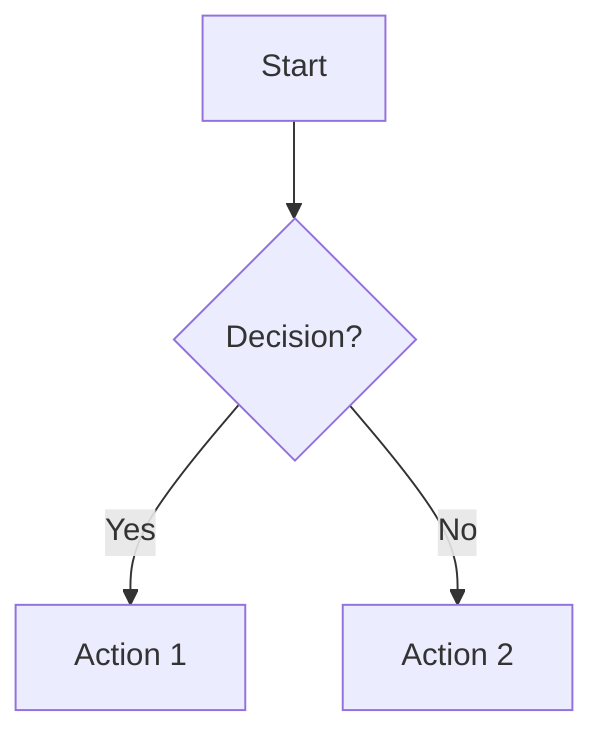
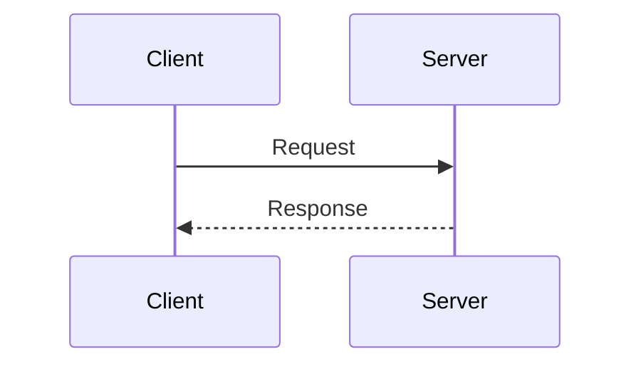
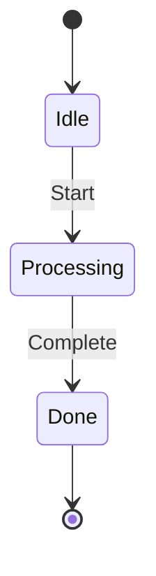
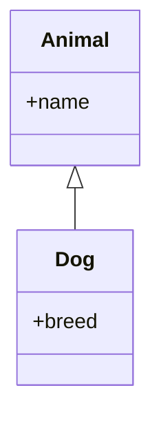
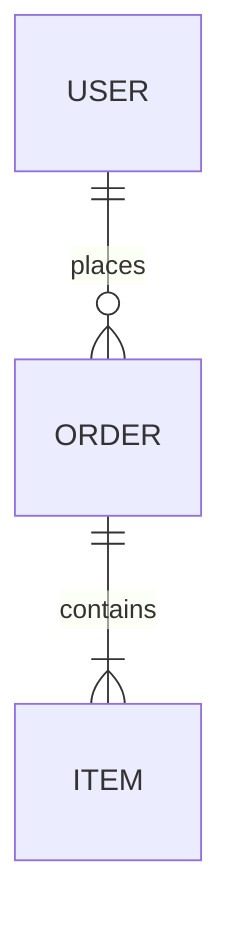
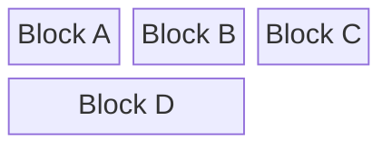
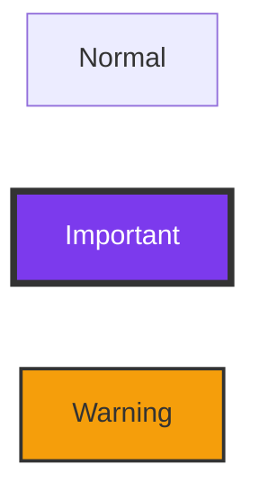
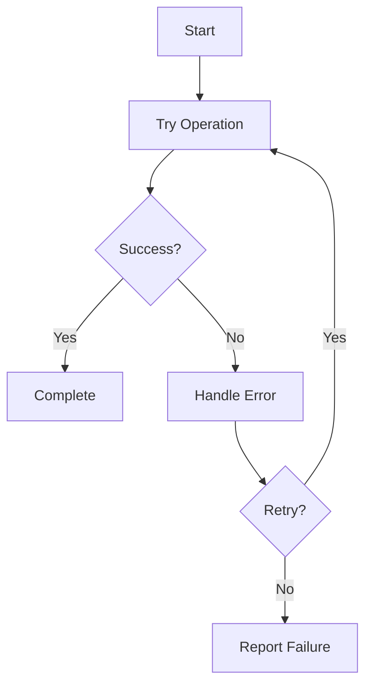
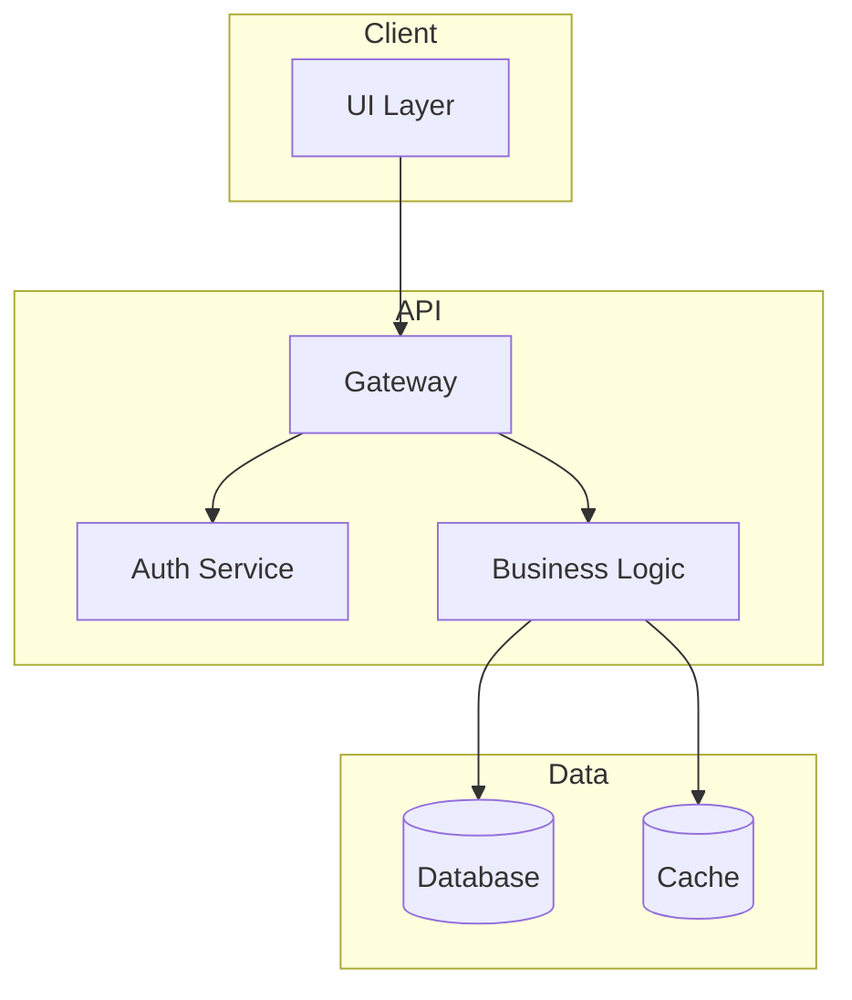

# MermaidDiagram Reference

## Common Parsing Errors & Rules

### Fatal Errors
- **"end" keyword**: Use `End`, `END`, or quotes `["end"]` - lowercase breaks flowcharts
- **Leading "o" or "x"**: Use `A --- O` not `A---oB` (creates circle edge)
- **Special characters**: Quote node names with brackets/spaces: `["Kill Minions"]`
- **YAML frontmatter**: Consistent indentation required, case-sensitive
- **Unknown words**: Any typo/unknown word breaks the entire diagram

### Silent Failures
- Misspelled theme variables are ignored
- Incorrect node references fail silently
- Comments must be on own line with `%%`

## Color Schemes for Contrast

### Theme Selection
```mermaid
%%{init: {'theme':'default'}}%%
```
**WARNING**: Specifying a theme breaks GitHub dark mode auto-adaptation. Use default behavior when possible.

### High Contrast Color Sets

**For white text on dark backgrounds:**
```yaml
primaryColor: '#1f2937'      # Dark gray
primaryBorderColor: '#374151'
secondaryColor: '#7c3aed'    # Purple
tertiaryColor: '#0891b2'     # Cyan
background: '#111827'        # Near black
```

**For black text on light backgrounds:**
```yaml
primaryColor: '#dbeafe'      # Light blue
primaryBorderColor: '#60a5fa'
secondaryColor: '#fef3c7'    # Light amber
tertiaryColor: '#d1fae5'     # Light green
background: '#ffffff'
```

**Universal high-contrast:**
- `#0969da` - Blue (works on white/black)
- `#cf222e` - Red (works on white/black)
- `#1a7f37` - Green (works on white/black)
- `#9333ea` - Purple (works on white/black)

## Diagram Type Selection Guide

### flowchart - Processes & Logic

**Best for**: Algorithms, workflows, decision trees, system flows

### sequenceDiagram - Temporal Interactions

**Best for**: API calls, protocols, user interactions, time-ordered events

### stateDiagram-v2 - State Machines

**Best for**: Lifecycle management, status flows, finite state machines

### classDiagram - Structure & Relationships

**Best for**: Object models, inheritance, system architecture

### erDiagram - Data Relationships

**Best for**: Database schemas, entity relationships, data models

### block - Controlled Layout

**Best for**: System overviews where automatic layout fails, architectural diagrams

## Best Practices

### Clarity First
1. Start simple, add complexity gradually
2. Use descriptive labels, not abbreviations
3. Maintain consistent direction (TD or LR)
4. Break large diagrams into focused sub-diagrams
5. Use subgraphs to group related elements

### Styling Guidelines


### Node Shapes Quick Reference
- `[Rectangle]` - Default, general purpose
- `([Rounded])` - Start/end points
- `{Diamond}` - Decisions
- `[(Database)]` - Data storage
- `((Circle))` - Connectors
- `[/Parallelogram/]` - Input/output

### Edge Types
- `-->` Solid arrow
- `---` Solid line
- `-.->` Dotted arrow
- `==>` Thick arrow
- `--Text-->` Labeled edge

## Accessibility

Always include:
```mermaid
%%{init: {
  'theme': 'default',
  'themeVariables': {
    'fontSize': '16px'
  }
}}%%
graph TD
    accTitle: Diagram Title
    accDescr: Detailed description for screen readers
```

## Performance Tips

1. Use `elk` renderer for complex diagrams:
   ```mermaid
   %%{init: {"flowchart": {"defaultRenderer": "elk"}} }%%
   ```

2. Limit nodes to ~50 per diagram
3. Avoid deep nesting (>5 levels)
4. Use aliases for repeated nodes

## Common Patterns

### Error Handling Flow


### API Architecture


---

Remember: Mermaid prioritizes readability over complexity. When in doubt, simplify.
